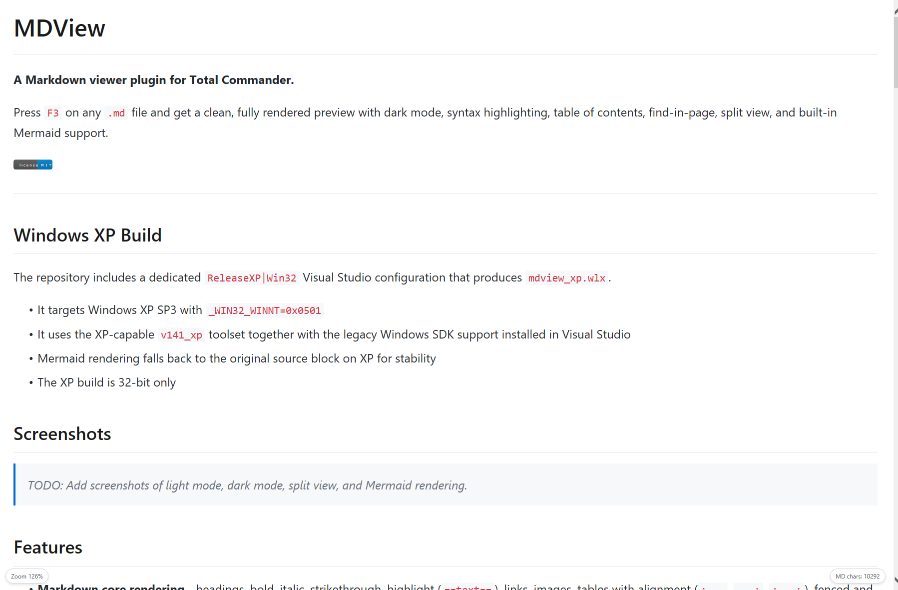
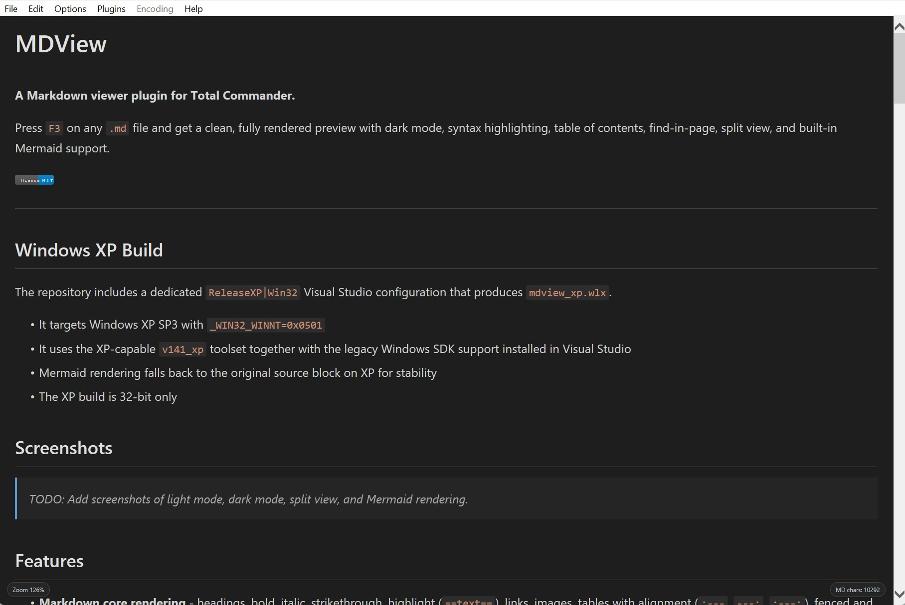
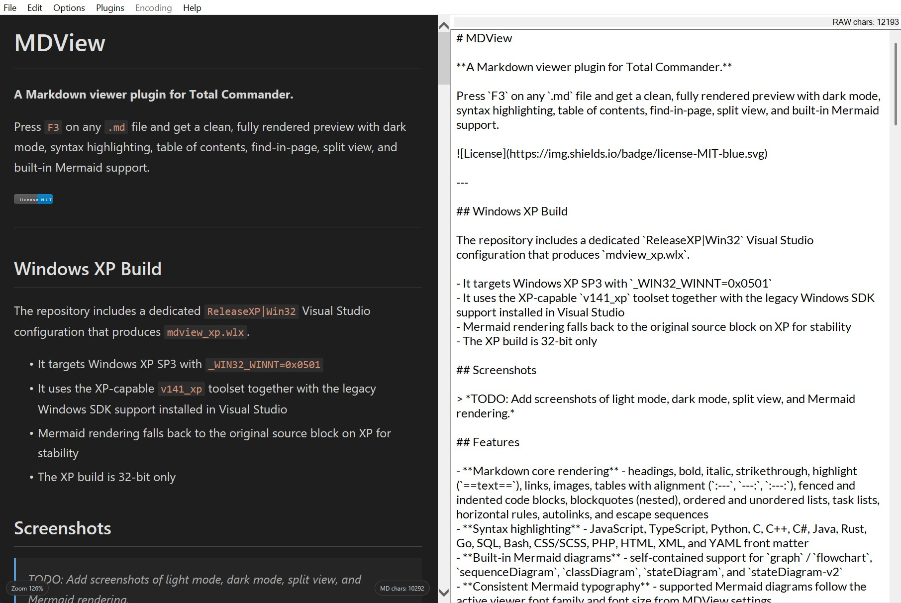
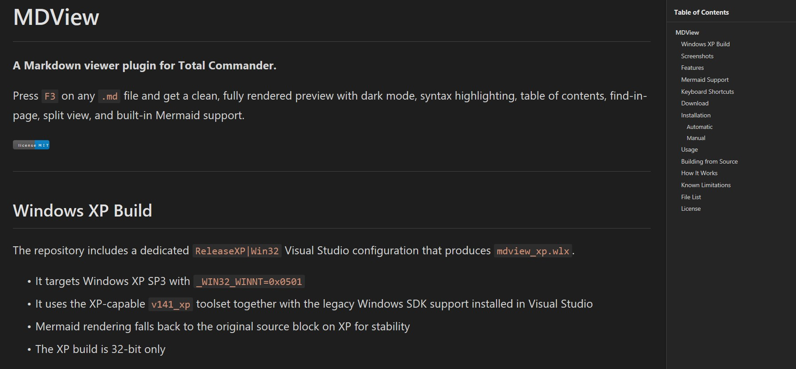
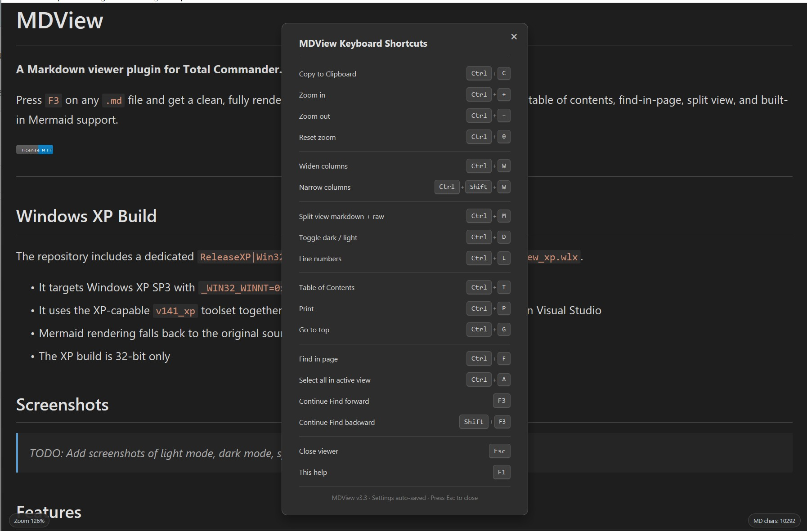
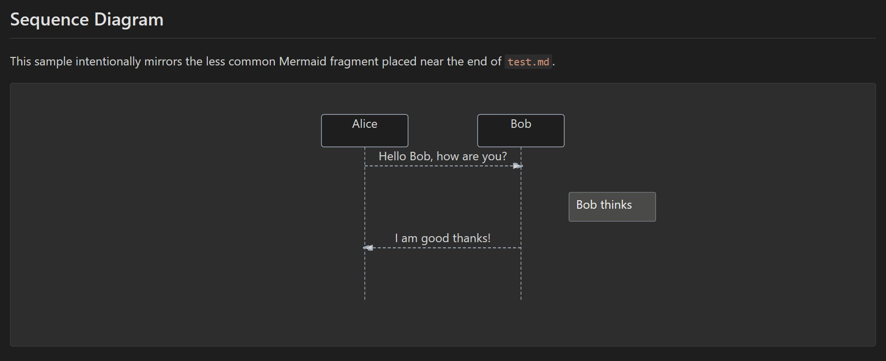
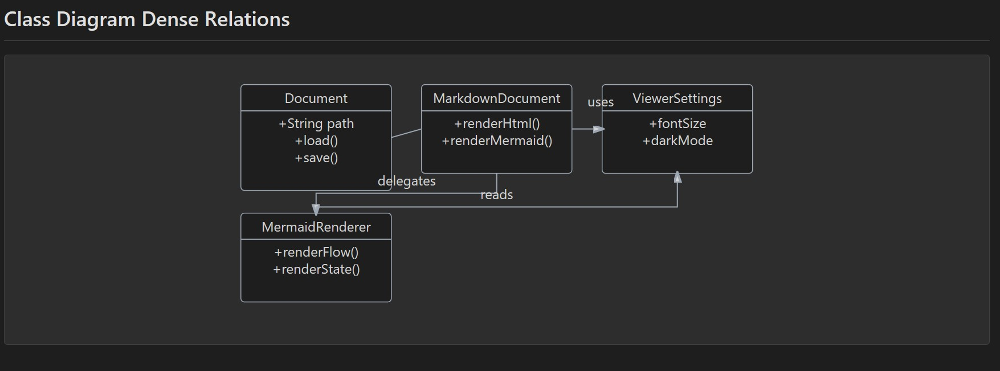
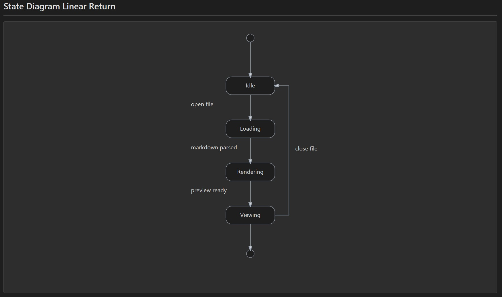

# MDView

**A Markdown viewer plugin for Total Commander.**

Press `F3` on any `.md` file and get a clean, fully rendered preview with dark mode, syntax highlighting, table of contents, find-in-page, split view, and built-in Mermaid support.

---

## Windows XP Build

The repository includes a dedicated `ReleaseXP|Win32` Visual Studio configuration that produces `mdview_xp.wlx`.

- It targets Windows XP SP3 with `_WIN32_WINNT=0x0501`
- It uses the XP-capable `v141_xp` toolset together with the legacy Windows SDK support installed in Visual Studio
- Mermaid rendering falls back to the original source block on XP for stability
- The XP build is 32-bit only

## Screenshots

| Light Mode                                | Dark Mode                               |
| ----------------------------------------- | --------------------------------------- |
|  |  |

| Split View                                | Table of Contents                     |
| ----------------------------------------- | ------------------------------------- |
|  |  |

| Help View                               | Mermaid Rendering 1                                         |
| --------------------------------------- | ----------------------------------------------------------- |
|  |  |

| Mermaid Rendering 2                                         | Mermaid Rendering 3                                         |
| ----------------------------------------------------------- | ----------------------------------------------------------- |
|  |  |

## Features

- **Markdown core rendering** - headings, bold, italic, strikethrough, highlight (`==text==`), links, images, tables with alignment (`:---`, `---:`, `:---:`), fenced and indented code blocks, blockquotes (nested), ordered and unordered lists, task lists, horizontal rules, autolinks, and escape sequences
- **Syntax highlighting** - JavaScript, TypeScript, Python, C, C++, C#, Java, Rust, Go, SQL, Bash, CSS/SCSS, PHP, HTML, XML, and YAML front matter
- **Built-in Mermaid diagrams** - self-contained support for `graph` / `flowchart`, `sequenceDiagram`, `classDiagram`, `stateDiagram`, and `stateDiagram-v2`
- **Consistent Mermaid typography** - supported Mermaid diagrams follow the active viewer font family and font size from MDView settings
- **Emoji shortcode support** - a curated set of common shortcodes such as `:smile:`, `:heart:`, `:+1:`, `:rocket:`, `:warning:`, `:white_check_mark:`, and similar everyday aliases
- **Dark / light mode** - toggle with `Ctrl+D`, or auto-detected from the Windows theme on first launch
- **Adjustable layout** - zoom in and out, optionally constrain reading column width
- **Line numbers** - toggle on code blocks with `Ctrl+L`
- **Table of Contents** - auto-generated sidebar from headings
- **Find in page** - incremental search with match highlighting and navigation
- **Tooltip on links** - hovering a link shows the resolved target URL
- **Relative link handling** - local Markdown links and images resolve correctly against the current document, including `./`, `../`, nested paths, and `#fragment` suffixes
- **Safe link opening** - linked Markdown files open inside MDView instead of blanking the embedded browser; other links are handed off to Windows
- **YAML front matter rendering** - top-of-file `--- ... ---` metadata blocks in SKILL-style documents render as highlighted YAML instead of ordinary paragraph text
- **Split view** - rendered Markdown alongside the raw Markdown source with `Ctrl+M`
- **Raw Markdown viewer** - implemented with the Windows RichEdit control using a configurable monospace font
- **Character count with spaces** - both rendered and raw views show a character count aligned to a Word-like convention that excludes line breaks
- **Scroll synchronisation** - rendered HTML and raw Markdown views stay aligned using ratio-based document scrolling
- **Smart clipboard behaviour**
  - Copy from rendered view -> formatted HTML + plain text
  - Copy from raw view -> original Markdown text
- **Expand / collapse** - long code blocks and blockquotes are collapsed by default with a "Show more" button
- **Raw HTML collapsible sections** - block-level `
` / `
` sections are preserved, with a viewer fallback for older MSHTML engines that do not implement native HTML5 details controls
- **Persistent settings** - font size, theme, column width, line numbers, and raw view settings are saved and restored between sessions
- **Print support** - `Ctrl+P` renders a clean printable version
- **Progress bar** - subtle reading position indicator at the top of the viewport
- **Full window resize** - content fills the viewport correctly when the lister window is resized or maximised
- **Respect Total Commander interaction patterns** where applicable. Keys `1..9`, `N`, and `P` are forwarded according to the lister concept, `F3` / `Shift+F3` continue in-page search, `F7` opens search, and TC menu commands such as Copy, Select all, Print, and scroll-percent are wired through the WLX command callbacks
- No temporary HTML files are created; everything stays in memory
- Support for mixed Markdown and HTML content

## Mermaid Support

Mermaid rendering is built directly into the plugin and is fully self-contained inside the `.wlx` and `.wlx64` binaries. No external JavaScript files are required in the distribution.

Currently supported Mermaid diagram types:

- `graph` / `flowchart`
- `sequenceDiagram`
- `classDiagram`
- `stateDiagram`
- `stateDiagram-v2`

For the supported diagram types, MDView keeps Mermaid output aligned with the surrounding document typography and scales SVG output to fit the available preview width without pathological oversizing.

Unsupported Mermaid syntaxes fall back safely to the original source block instead of breaking the preview.

For the dedicated Windows XP build, Mermaid blocks fall back to the original source block instead of rendered diagrams. This keeps the XP target stable while preserving full Mermaid rendering on the modern Win32 and x64 builds.

## Keyboard Shortcuts

| Shortcut           | Action                            |
| ------------------ | --------------------------------- |
| `Ctrl` `+`         | Zoom in                           |
| `Ctrl` `-`         | Zoom out                          |
| `Ctrl` `0`         | Reset zoom                        |
| `Ctrl` `W`         | Constrain column width            |
| `Ctrl` `Shift` `W` | Widen or remove column constraint |
| `Ctrl` `D`         | Toggle dark / light mode          |
| `Ctrl` `L`         | Toggle line numbers               |
| `Ctrl` `T`         | Table of Contents                 |
| `Ctrl` `F`         | Find in page                      |
| `Ctrl` `P`         | Print                             |
| `Ctrl` `G`         | Go to top                         |
| `Ctrl` `M`         | Toggle split view                 |
| `Ctrl` `A`         | Select all in active view         |
| `Ctrl` `C`         | Copy selection                    |
| `F3`               | Find next                         |
| `Shift` `F3`       | Find previous                     |
| `F7`               | Open find                         |
| `Esc`              | Close viewer                      |
| `F1`               | Show shortcut reference           |

Press `F1` inside the viewer for an on-screen reference.

## Download

Grab the latest release from the [Releases](../../releases) page. The distribution includes modern Win32 (`mdview.wlx`), x64 (`mdview.wlx64`), and Windows XP (`mdview_xp.wlx`) builds.

## Installation

### Automatic

Open the downloaded `.zip` file inside Total Commander. The included `pluginst.inf` triggers the automatic plugin installer.

### Manual

1. Extract `mdview.wlx` or `mdview.wlx64` to a directory of your choice.
2. In Total Commander open **Configuration -> Options -> Plugins -> Lister (WLX) -> Add**.
3. Select the `.wlx` / `.wlx64` file.
4. The detect string auto-configures for `.md`, `.markdown`, `.mkd`, and `.mkdn` extensions.

## Usage

1. Navigate to any Markdown file in Total Commander.
2. Press `F3` to open the lister.
3. Use the keyboard shortcuts to customise the view. Preferences are saved automatically.

For Mermaid validation, use `test_mermaid.md`. It covers the Mermaid diagram families currently supported by MDView. For a broad Markdown regression sample, use `test.md`.

For relative-link and front-matter regression checks, use `Sample_md_files\readme_problematic.md` and `Sample_md_files\SKILL.md`.

For collapsible-section regression checks, use `Sample_md_files\markdown_en.md`.

For embedded-image regression reference, use `Sample_md_files\file_with_embedded_image.md` to verify the current unsupported case documented below.

## Building from Source

The plugin is implemented in a single C source file and can be built natively on Windows with MSVC.

The raw Markdown view uses the built-in **RichEdit (Msftedit.dll)** control available on modern Windows systems.

Visual Studio configurations:

- `Release|Win32` - modern 32-bit build (`mdview.wlx`)
- `Release|x64` - modern 64-bit build (`mdview.wlx64`)
- `ReleaseXP|Win32` - Windows XP-compatible 32-bit build (`mdview_xp.wlx`)

The `ReleaseXP|Win32` configuration targets `_WIN32_WINNT=0x0501` with the XP toolset and keeps the XP-specific fallbacks isolated in local compatibility helpers.

The project also includes `resource.rc` and `resource.h`, so the Win32, x64, and XP binaries embed Windows file version metadata directly.

## How It Works

MDView is a WLX lister plugin that Total Commander loads when you press `F3` on a matching file type. It contains a built-in Markdown-to-HTML converter and embeds an MSHTML WebBrowser control to render the output. Keyboard input is handled by subclassing the browser's internal window, giving reliable hotkey interception without interfering with normal scrolling or Total Commander key handling. The OLE control and its child window hierarchy are resized via `IOleInPlaceObject::SetObjectRects` and `MoveWindow` so the viewer fills the lister window at any size. Settings are persisted via the standard Total Commander INI mechanism.

## Known Limitations

MDView intentionally implements a pragmatic Markdown subset rather than a full CommonMark / GFM engine. The current tradeoff favors a single-file, dependency-light viewer over exhaustive spec coverage.

- **Math formulas are not rendered.** `$...$` and `$$...$$` are not interpreted as TeX/LaTeX math.
- **Emoji shortcode support is curated, not exhaustive.** Common shortcodes are supported, but MDView does not ship a full GitHub-style emoji catalog.
- **Reference-style image and link definitions are limited.** Inline links/images are the primary supported path. Sample cases such as embedded `data:` image references at the end of the document are not fully supported.
- **Raw HTML passthrough is selective.** `<table>` and block-level `
` / `
` are preserved, but MDView is not a full generic HTML block parser.
- **`
` support may use a viewer fallback.** On older MSHTML engines, collapsible sections are emulated in script rather than provided natively by the browser control.
- **Mermaid support is intentionally partial.** Supported diagram families are `graph` / `flowchart`, `sequenceDiagram`, `classDiagram`, `stateDiagram`, and `stateDiagram-v2`. Other Mermaid syntaxes fall back to the original source block.
- **Mermaid on Windows XP is disabled.** XP builds show Mermaid source blocks instead of rendered diagrams for stability.
- **Directives such as `[TOC]` and footnotes are not fully implemented.** They may render as ordinary text rather than as generated navigation or note structures.
- **The parser is not a full spec-compliance engine.** Edge cases involving deeply nested emphasis, exotic HTML/Markdown interactions, or advanced extension syntax may differ from CommonMark/GFM behavior.

## File List

| File              | Description                                                                                        |
| ----------------- | -------------------------------------------------------------------------------------------------- |
| `mdview.c`        | Complete plugin source                                                                             |
| `mdview.def`      | DLL export definitions                                                                             |
| `resource.rc`     | Windows version resource embedded into the generated WLX binaries                                  |
| `resource.h`      | Shared version-number macros used by the resource script                                           |
| `pluginst.inf`    | Total Commander auto-install manifest                                                              |
| `test.md`         | Broad Markdown regression and feature sample                                                       |
| `test_mermaid.md` | Dedicated Mermaid sample document covering the Mermaid diagram types currently supported by MDView |

## License

[MIT](LICENSE)
